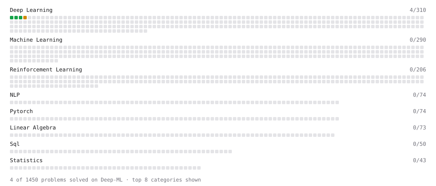

# Deep-ML

My machine learning practice from [Deep-ML](https://www.deep-ml.com). Every solution here was written by hand.

**16** solved · 16 problems · 0 labs · 0 math

[**Browse the interactive portfolio**](https://SaM-0777.github.io/deep-ml/) to replay this filling in over time.

## Problems

| | Difficulty | Solved | |
| --- | --- | --- | --- |
| [Adagrad Optimizer](https://www.deep-ml.com/problems/145) | easy | 2026-09-25 | [solution](problems/0145-adagrad-optimizer) |
| [Adamax Optimizer](https://www.deep-ml.com/problems/148) | easy | 2026-09-25 | [solution](problems/0148-adamax-optimizer) |
| [Calculate Computational Efficiency of MoE](https://www.deep-ml.com/problems/123) | easy | 2026-09-25 | [solution](problems/0123-calculate-computational-efficiency-of-moe) |
| [GeLU Activation Function ](https://www.deep-ml.com/problems/147) | easy | 2026-09-25 | [solution](problems/0147-gelu-activation-function) |
| [Implement ReLU Activation Function](https://www.deep-ml.com/problems/42) | easy | 2026-09-24 | [solution](problems/0042-implement-relu-activation-function) |
| [Implementation of Log Softmax Function](https://www.deep-ml.com/problems/39) | easy | 2026-09-24 | [solution](problems/0039-implementation-of-log-softmax-function) |
| [KL Divergence Between Two Normal Distributions](https://www.deep-ml.com/problems/56) | easy | 2026-09-24 | [solution](problems/0056-kl-divergence-between-two-normal-distributions) |
| [Leaky ReLU Activation Function](https://www.deep-ml.com/problems/44) | easy | 2026-09-24 | [solution](problems/0044-leaky-relu-activation-function) |
| [Momentum Optimizer](https://www.deep-ml.com/problems/146) | easy | 2026-09-25 | [solution](problems/0146-momentum-optimizer) |
| [Sigmoid Activation Function Understanding](https://www.deep-ml.com/problems/22) | easy | 2026-09-24 | [solution](problems/0022-sigmoid-activation-function-understanding) |
| [Single Neuron](https://www.deep-ml.com/problems/24) | easy | 2026-09-24 | [solution](problems/0024-single-neuron) |
| [Softmax Activation Function Implementation ](https://www.deep-ml.com/problems/23) | easy | 2026-09-24 | [solution](problems/0023-softmax-activation-function-implementation) |
| [Adadelta Optimizer](https://www.deep-ml.com/problems/149) | medium | 2026-09-25 | [solution](problems/0149-adadelta-optimizer) |
| [Implement Self-Attention Mechanism](https://www.deep-ml.com/problems/53) | medium | 2026-09-24 | [solution](problems/0053-implement-self-attention-mechanism) |
| [Simple Convolutional 2D Layer](https://www.deep-ml.com/problems/41) | medium | 2026-09-24 | [solution](problems/0041-simple-convolutional-2d-layer) |
| [Single Neuron with Backpropagation](https://www.deep-ml.com/problems/25) | medium | 2026-09-24 | [solution](problems/0025-single-neuron-with-backpropagation) |

---

_This file is regenerated by Deep-ML on every push._
