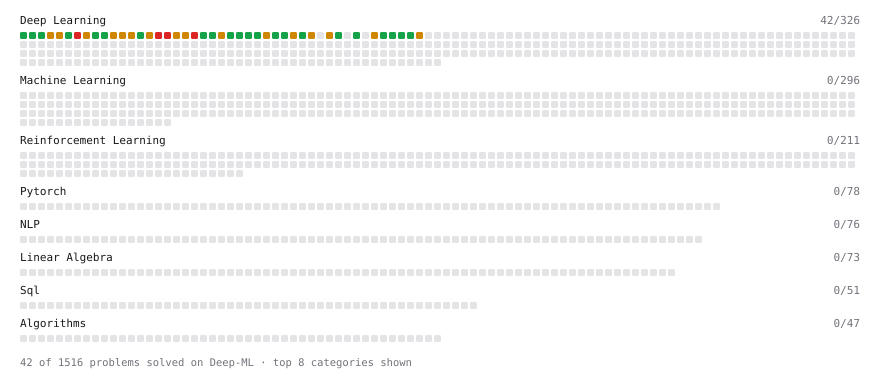

# Deep-ML

My machine learning practice from [Deep-ML](https://www.deep-ml.com). Every solution here was written by hand.

**48** solved · 48 problems · 0 labs · 0 math

[**Browse the interactive portfolio**](https://SaM-0777.github.io/deep-ml/) to replay this filling in over time.

## Problems

| | Difficulty | Solved | |
| --- | --- | --- | --- |
| [Adagrad Optimizer](https://www.deep-ml.com/problems/145) | easy | 2026-09-25 | [solution](problems/0145-adagrad-optimizer) |
| [Adamax Optimizer](https://www.deep-ml.com/problems/148) | easy | 2026-09-25 | [solution](problems/0148-adamax-optimizer) |
| [Calculate Computational Efficiency of MoE](https://www.deep-ml.com/problems/123) | easy | 2026-09-25 | [solution](problems/0123-calculate-computational-efficiency-of-moe) |
| [Compute Multi-class Cross-Entropy Loss](https://www.deep-ml.com/problems/134) | easy | 2026-09-25 | [solution](problems/0134-compute-multi-class-cross-entropy-loss) |
| [Derivatives of Activation Functions](https://www.deep-ml.com/problems/217) | easy | 2026-10-07 | [solution](problems/0217-derivatives-of-activation-functions) |
| [Dynamic Tanh: Normalization-Free Transformer Activation](https://www.deep-ml.com/problems/128) | easy | 2026-09-25 | [solution](problems/0128-dynamic-tanh-normalization-free-transformer-activation) |
| [GeLU Activation Function ](https://www.deep-ml.com/problems/147) | easy | 2026-09-25 | [solution](problems/0147-gelu-activation-function) |
| [Implement a Simple Residual Block with Shortcut Connection](https://www.deep-ml.com/problems/113) | easy | 2026-10-03 | [solution](problems/0113-implement-a-simple-residual-block-with-shortcut-connection) |
| [Implement Binary Cross-Entropy Loss](https://www.deep-ml.com/problems/263) | easy | 2026-10-07 | [solution](problems/0263-implement-binary-cross-entropy-loss) |
| [Implement Global Average Pooling](https://www.deep-ml.com/problems/114) | easy | 2026-10-03 | [solution](problems/0114-implement-global-average-pooling) |
| [Implement ReLU Activation Function](https://www.deep-ml.com/problems/42) | easy | 2026-09-24 | [solution](problems/0042-implement-relu-activation-function) |
| [Implement SwiGLU activation function](https://www.deep-ml.com/problems/156) | easy | 2026-10-05 | [solution](problems/0156-implement-swiglu-activation-function) |
| [Implement the ELU Activation Function](https://www.deep-ml.com/problems/97) | easy | 2026-09-25 | [solution](problems/0097-implement-the-elu-activation-function) |
| [Implement the Hard Sigmoid Activation Function](https://www.deep-ml.com/problems/96) | easy | 2026-09-25 | [solution](problems/0096-implement-the-hard-sigmoid-activation-function) |
| [Implement the Mish Activation Function](https://www.deep-ml.com/problems/262) | easy | 2026-10-07 | [solution](problems/0262-implement-the-mish-activation-function) |
| [Implement the SELU Activation Function](https://www.deep-ml.com/problems/103) | easy | 2026-09-25 | [solution](problems/0103-implement-the-selu-activation-function) |
| [Implement the Softplus Activation Function](https://www.deep-ml.com/problems/99) | easy | 2026-09-25 | [solution](problems/0099-implement-the-softplus-activation-function) |
| [Implement the Softsign Activation Function](https://www.deep-ml.com/problems/100) | easy | 2026-09-25 | [solution](problems/0100-implement-the-softsign-activation-function) |
| [Implement the Swish Activation Function](https://www.deep-ml.com/problems/102) | easy | 2026-09-25 | [solution](problems/0102-implement-the-swish-activation-function) |
| [Implementation of Log Softmax Function](https://www.deep-ml.com/problems/39) | easy | 2026-09-24 | [solution](problems/0039-implementation-of-log-softmax-function) |
| [KL Divergence Between Two Normal Distributions](https://www.deep-ml.com/problems/56) | easy | 2026-09-24 | [solution](problems/0056-kl-divergence-between-two-normal-distributions) |
| [Leaky ReLU Activation Function](https://www.deep-ml.com/problems/44) | easy | 2026-09-24 | [solution](problems/0044-leaky-relu-activation-function) |
| [Momentum Optimizer](https://www.deep-ml.com/problems/146) | easy | 2026-09-25 | [solution](problems/0146-momentum-optimizer) |
| [Nesterov Accelerated Gradient Optimizer](https://www.deep-ml.com/problems/150) | easy | 2026-10-07 | [solution](problems/0150-nesterov-accelerated-gradient-optimizer) |
| [Sigmoid Activation Function Understanding](https://www.deep-ml.com/problems/22) | easy | 2026-09-24 | [solution](problems/0022-sigmoid-activation-function-understanding) |
| [Single Neuron](https://www.deep-ml.com/problems/24) | easy | 2026-09-24 | [solution](problems/0024-single-neuron) |
| [Softmax Activation Function Implementation ](https://www.deep-ml.com/problems/23) | easy | 2026-09-24 | [solution](problems/0023-softmax-activation-function-implementation) |
| [Thanksgiving Feast Predictor: Softmax for Dish Selection](https://www.deep-ml.com/problems/216) | easy | 2026-10-07 | [solution](problems/0216-thanksgiving-feast-predictor-softmax-for-dish-selection) |
| [Adadelta Optimizer](https://www.deep-ml.com/problems/149) | medium | 2026-09-25 | [solution](problems/0149-adadelta-optimizer) |
| [Adam Optimizer](https://www.deep-ml.com/problems/87) | medium | 2026-10-04 | [solution](problems/0087-adam-optimizer) |
| [Implement Adam Optimization Algorithm](https://www.deep-ml.com/problems/49) | medium | 2026-09-26 | [solution](problems/0049-implement-adam-optimization-algorithm) |
| [Implement Batch Normalization for BCHW Input](https://www.deep-ml.com/problems/115) | medium | 2026-10-05 | [solution](problems/0115-implement-batch-normalization-for-bchw-input) |
| [Implement Group Normalization](https://www.deep-ml.com/problems/126) | medium | 2026-10-05 | [solution](problems/0126-implement-group-normalization) |
| [Implement Long Short-Term Memory (LSTM) Network](https://www.deep-ml.com/problems/59) | medium | 2026-10-03 | [solution](problems/0059-implement-long-short-term-memory-lstm-network) |
| [Implement Masked Self-Attention](https://www.deep-ml.com/problems/107) | medium | 2026-10-04 | [solution](problems/0107-implement-masked-self-attention) |
| [Implement PReLU Forward and Backward Pass](https://www.deep-ml.com/problems/98) | medium | 2026-10-03 | [solution](problems/0098-implement-prelu-forward-and-backward-pass) |
| [Implement Self-Attention Mechanism](https://www.deep-ml.com/problems/53) | medium | 2026-09-24 | [solution](problems/0053-implement-self-attention-mechanism) |
| [Implement the Noisy Top-K Gating Function](https://www.deep-ml.com/problems/124) | medium | 2026-10-05 | [solution](problems/0124-implement-the-noisy-top-k-gating-function) |
| [Implementing a Simple RNN](https://www.deep-ml.com/problems/54) | medium | 2026-09-26 | [solution](problems/0054-implementing-a-simple-rnn) |
| [Implementing Basic Autograd Operations](https://www.deep-ml.com/problems/26) | medium | 2026-09-25 | [solution](problems/0026-implementing-basic-autograd-operations) |
| [Instance Normalization (IN) Implementation](https://www.deep-ml.com/problems/143) | medium | 2026-10-05 | [solution](problems/0143-instance-normalization-in-implementation) |
| [Simple Convolutional 2D Layer](https://www.deep-ml.com/problems/41) | medium | 2026-09-24 | [solution](problems/0041-simple-convolutional-2d-layer) |
| [Single Neuron with Backpropagation](https://www.deep-ml.com/problems/25) | medium | 2026-09-24 | [solution](problems/0025-single-neuron-with-backpropagation) |
| [The Pattern Weaver's Code](https://www.deep-ml.com/problems/89) | medium | 2026-10-04 | [solution](problems/0089-the-pattern-weaver-s-code) |
| [Implement a Simple RNN with Backpropagation Through Time (BPTT)](https://www.deep-ml.com/problems/62) | hard | 2026-10-05 | [solution](problems/0062-implement-a-simple-rnn-with-backpropagation-through-time-bptt) |
| [Implement Multi-Head Attention](https://www.deep-ml.com/problems/94) | hard | 2026-10-04 | [solution](problems/0094-implement-multi-head-attention) |
| [Implementing a Custom Dense Layer in Python](https://www.deep-ml.com/problems/40) | hard | 2026-10-03 | [solution](problems/0040-implementing-a-custom-dense-layer-in-python) |
| [Positional Encoding Calculator](https://www.deep-ml.com/problems/85) | hard | 2026-10-04 | [solution](problems/0085-positional-encoding-calculator) |

---

_This file is regenerated by Deep-ML on every push._
